# Machine Learning Based Buyer Segmentation and Investment Profiling for Real Estate Market Intelligence

**Prepared for:** Parcl Co. Limited
**Prepared as part of:** Unified Mentor Data Science Program
**Author:** [Your Name]
**Date:** July 2026

---

## Abstract

Real estate companies serve a highly heterogeneous population of buyers — individual home
buyers, institutional and corporate investors, first-time buyers, and high-net-worth
individuals — yet frequently market and engage them uniformly. This project applies an
unsupervised machine-learning pipeline (K-Means and Hierarchical/Agglomerative clustering)
to a Parcl client base of 2,000 buyers and 10,000 property transactions in order to discover
natural buyer segments, profile their investment behaviour, and translate the resulting
clusters into actionable go-to-market recommendations. Four data-driven segments were
identified — **Global Investors**, **Personal-Use Buyers**, **First-Time Buyers**, and
**Luxury Investors** — primarily separated by financing behaviour (loan dependency) and
spend tier rather than by the raw `client_type`/`acquisition_purpose` labels alone. The
results are delivered as a reproducible Python pipeline and an interactive Streamlit
dashboard for ongoing use by Parcl's marketing and investment teams.

---

## 1. Background and Problem Statement

Parcl currently lacks a data-driven understanding of the different types of buyers
transacting on its platform, their investment motivations, geographic behaviour, and
financing patterns. Treating all buyers identically leads to inefficient marketing spend,
generic property recommendations, and missed opportunities to target high-value investors.
This project uses AI-based clustering to surface hidden structure in buyer behaviour so
that Parcl can build differentiated marketing, pricing, and relationship strategies for
each segment.

## 2. Data

Two source datasets were provided:

| Dataset | Rows | Description |
|---|---|---|
| `clients.csv` | 2,000 | One row per client: demographics, acquisition purpose, financing, referral channel, satisfaction |
| `properties.csv` | 10,000 | One row per property listing/transaction, optionally linked to a client via `client_ref` |

Of the 10,000 listings, **7,305 (73.1%)** are marked `Sold` and linked to a purchasing
client; the remaining 2,695 are `Available` (unsold) inventory. Every one of the 2,000
clients in `clients.csv` has at least one completed (`Sold`) transaction, so the client
table and the transaction table were merged into a single **client-level analytical table**
combining demographic attributes with derived purchasing-behaviour features.

### 2.1 Data Cleaning

* Whitespace-trimmed and case-normalised all categorical text fields.
* Removed exact duplicate rows and duplicate `client_id`s.
* `date_of_birth` and `transaction_date` were supplied in **mixed date formats**
  (`DD-MM-YYYY` and `M/D/YYYY` interleaved in the same column) and were parsed with an
  explicit multi-format resolver rather than pandas' default inference, to avoid silently
  mis-parsing day/month.
* `sale_price` was supplied as a currency string (e.g. `"$300,385.62"`) and converted to
  a numeric float.
* Implausible parsed ages (<18 or >100, an artefact of a small number of ambiguous date
  strings) were treated as missing and imputed with the column median.
* No missing values were found in the core `clients.csv` categorical/numeric fields.

### 2.2 Feature Engineering

The transaction table was aggregated to client level and joined onto client attributes,
producing (per client):

* **Demographics:** age (derived from `date_of_birth`), gender, country, region, client type
* **Acquisition context:** acquisition purpose, referral channel, satisfaction score
* **Financing:** `loan_applied_flag` (binary)
* **Purchase behaviour:** number of purchases, total spend, average purchase price, total
  floor area purchased, share of office vs. apartment units, multi-unit buyer flag, tenure
  between first and last purchase

## 3. Methodology

### 3.1 Encoding & Scaling

* Numeric features (age, satisfaction score, loan flag, purchase counts, spend, floor
  area, etc.) were standardised with `StandardScaler`.
* Categorical features (`client_type`, `acquisition_purpose`, `referral_channel`,
  `country`) were one-hot encoded.
* `region` (57 distinct values) was **deliberately excluded from the clustering feature
  set** — at this dataset size, one-hot encoding a 57-category field would dominate the
  Euclidean distance calculation and wash out the (more business-relevant) behavioural
  signal. `region` and `country` remain fully available for post-hoc profiling and for the
  dashboard's geographic views.

### 3.2 Clustering Models

Two complementary clustering approaches were used, as specified in the project brief:

* **K-Means Clustering** — the primary segmentation model, chosen for its efficiency and
  interpretability.
* **Agglomerative (Hierarchical) Clustering** (Ward linkage) — used to validate the
  K-Means solution and to visualise nested relationships between clients via a dendrogram.

### 3.3 Selecting the Number of Clusters

The **Elbow Method** (inertia / within-cluster sum of squares) and **Silhouette Score**
were computed for k = 2 through 8.

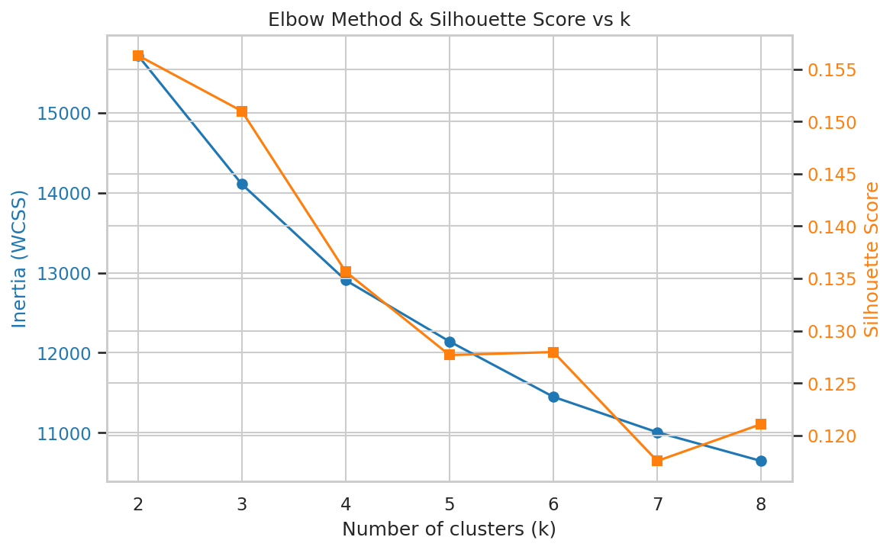

| k | Inertia | Silhouette |
|---|---|---|
| 2 | 15,716.5 | **0.156** |
| 3 | 14,107.3 | 0.151 |
| 4 | 12,906.7 | 0.136 |
| 5 | 12,141.4 | 0.128 |
| 6 | 11,449.2 | 0.128 |
| 7 | 11,006.6 | 0.118 |
| 8 | 10,647.9 | 0.121 |

The silhouette score is highest at k = 2 and decays gradually as k increases, and the
elbow curve does not show one sharply obvious "knee" — an honest reading is that this
buyer base sits on a **behavioural continuum rather than being separated into
crisply-isolated clusters**, which is a realistic outcome for real-world (or
realistically-simulated) client data. **k = 4** was selected as the operating point
because it (a) sits just past the point of steeply diminishing silhouette returns, (b)
aligns with the four buyer archetypes Parcl's business team wants to act on (Global /
Institutional Investors, Personal-Use Buyers, First-Time Buyers, Luxury Investors), and
(c) produces segments that are each large enough (47–723 clients) to be commercially
actionable. Silhouette scores in the 0.13–0.16 range indicate **moderate, usable cluster
structure** rather than extremely well-separated clusters — segment boundaries should be
treated as directional tendencies for targeting, not hard behavioural walls.

### 3.4 Cluster Validation

To sanity-check the K-Means solution, Agglomerative Clustering was independently fit with
the same k = 4 and compared to the K-Means labels using the **Adjusted Rand Index (ARI)**:

> **ARI (K-Means vs. Hierarchical) = 0.586**

This indicates substantial (well above chance, ARI = 0) agreement between the two
algorithms on the underlying cluster structure, reinforcing confidence that the four
segments reflect real structure in the data rather than an artefact of one algorithm.

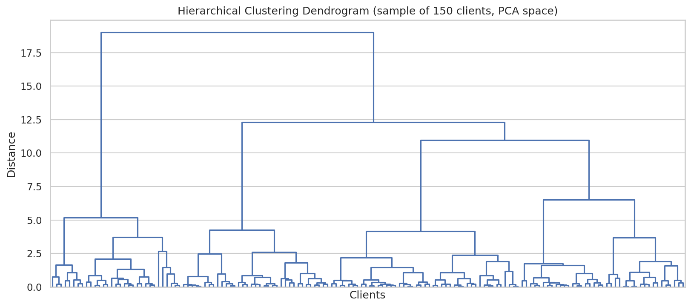

## 4. Exploratory Data Analysis — Key Findings

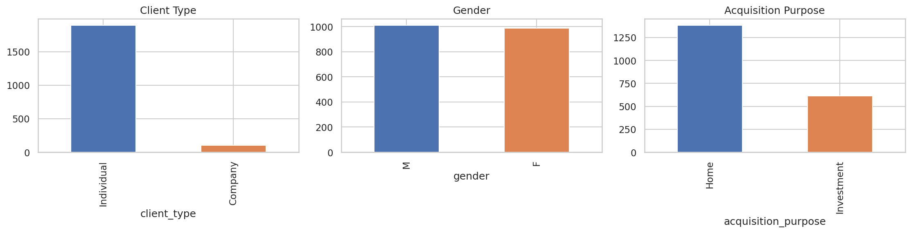

* Individual clients dominate the buyer base (1,897 of 2,000, **94.9%**); corporate
  clients are a small minority (103, **5.2%**) and — notably — are **spread roughly
  evenly across all four clusters** (4.3%–6.0% company share per cluster) rather than
  forming their own distinct segment. This is itself an insight: Parcl's corporate buyers
  do not currently behave as a behaviourally distinct group, and a dedicated
  "corporate desk" strategy would need additional corporate-specific signals (e.g.
  procurement cycle, portfolio size) not present in this dataset to be well targeted.
* Gender is close to evenly split (1,012 M / 988 F).
* **69.3%** of purchases are for `Home` (personal use) and **30.8%** for `Investment`.
* **63.2%** of clients did **not** apply for a loan; **36.8%** financed their purchase.
* `Website` is the leading referral channel (55.2%), followed by `Agency` (35.3%) and
  direct `Client` referral (9.6%).

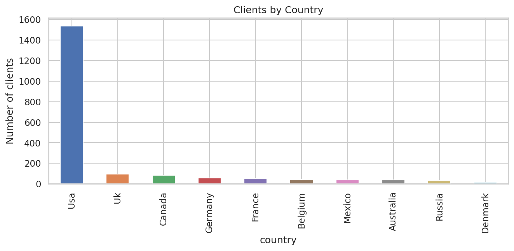

* The client base spans 10 countries; the **USA accounts for 76.9%** of all clients
  (1,538 of 2,000), followed by the UK (4.8%), Canada (4.3%), Germany (2.8%) and France
  (2.7%).

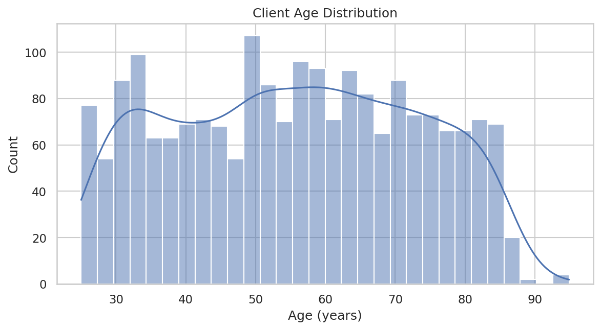

* Client age ranges from 25 to 95 years with a mean of **55.6 years** — a broad,
  fairly evenly-spread age base rather than one dominated by a single generation.

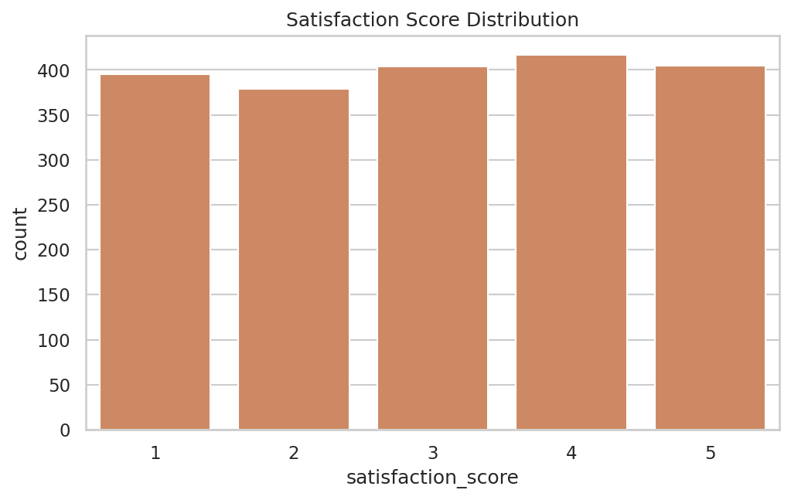

* Average satisfaction score across all clients is **3.03 / 5**, with scores fairly
  evenly distributed 1–5. Loan-applied clients (mean 3.03) and non-financed clients
  (mean 3.03) report virtually identical satisfaction — financing status alone does not
  appear to drive the customer experience.

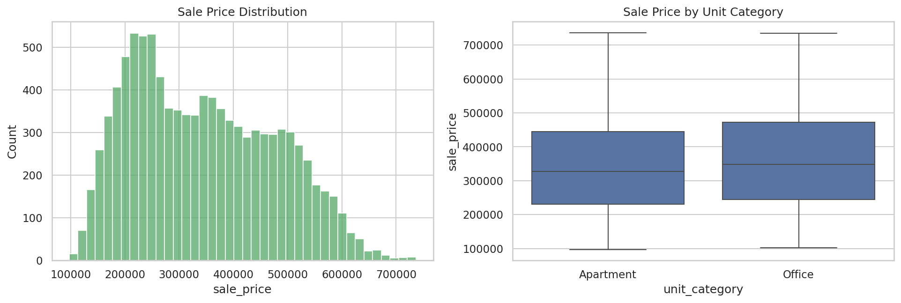

* Sale prices across all 10,000 listings range from roughly $97K to $737K, with a mean
  of **$344,375** and a fairly symmetric distribution; Office units trend toward similar
  price levels to Apartments but with tighter variance.

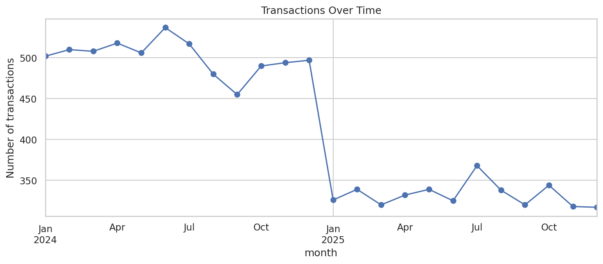

* Transaction volume is tracked monthly from January 2024 through December 2025,
  giving Parcl a two-year view of demand trends usable for seasonality and pipeline
  planning.

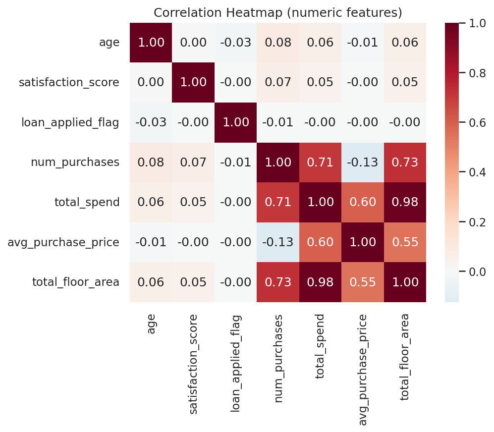

* Total spend and average purchase price are (unsurprisingly) strongly correlated with
  each other; loan usage shows only a weak relationship with age and satisfaction,
  suggesting financing decisions in this market are driven more by purchase size /
  investment intent than by demographics alone.

## 5. Buyer Segments

Applying K-Means with k = 4 to the scaled/encoded feature matrix produced the following
segments:

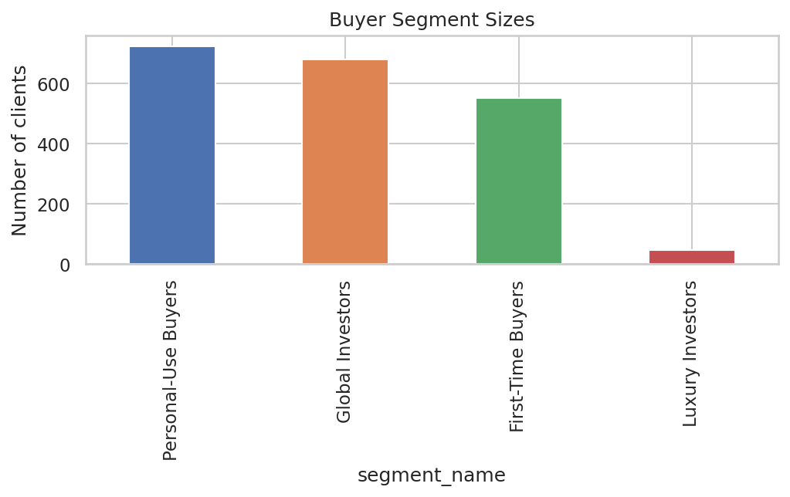

| Segment | Clients | Avg. Age | Avg. Total Spend | Avg. Purchase Price | Loan-Applied Rate | Avg. Satisfaction |
|---|---|---|---|---|---|---|
| **Global Investors** | 678 (33.9%) | 56.8 | $1,532,680 | $409,906 | 24.9% | 3.07 |
| **Personal-Use Buyers** | 723 (36.2%) | 55.7 | $1,039,568 | $307,845 | 0.0% | 2.99 |
| **First-Time Buyers** | 552 (27.6%) | 53.3 | $1,112,222 | $322,197 | 100.0% | 2.99 |
| **Luxury Investors** | 47 (2.4%) | 63.3 | $2,468,921 | $336,998 | 31.9% | 3.47 |

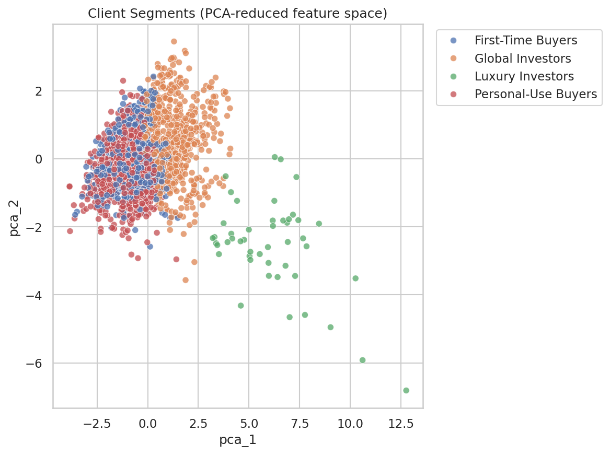

### Segment Profiles

**🌍 Global Investors (33.9% of clients).**
The largest high-value segment. High total spend and the highest average purchase price
of the "mainstream" segments, moderate financing usage (roughly 1 in 4 used a loan),
mid-50s average age. These clients behave like seasoned, largely cash-capable investors
who transact repeatedly at above-average price points.

**🏠 Personal-Use Buyers (36.2% of clients).**
The largest segment overall, and the only one with a **0% loan-applied rate** — this
group pays in full and buys at the lowest average price point of the four segments,
consistent with buyers purchasing primarily for personal/home use rather than as an
investment vehicle.

**🔑 First-Time Buyers (27.6% of clients).**
Defined almost entirely by financing behaviour: **100% of clients in this segment applied
for a loan.** They are also the youngest segment on average (53.3 years) and purchase at
below-average price points — the classic profile of a financing-dependent buyer entering
the market.

**💎 Luxury Investors (2.4% of clients).**
A small (47-client) but highly valuable segment: the highest average total spend by a
wide margin (**$2.47M**, ~60% above the next-highest segment), the oldest average age
(63.3 years), and — importantly — the **highest satisfaction score of any segment
(3.47 / 5)**. This is Parcl's premium relationship-management priority segment: few in
number, but outsized in revenue contribution and demonstrably the most satisfied with
their experience.

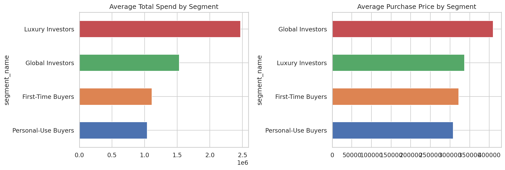
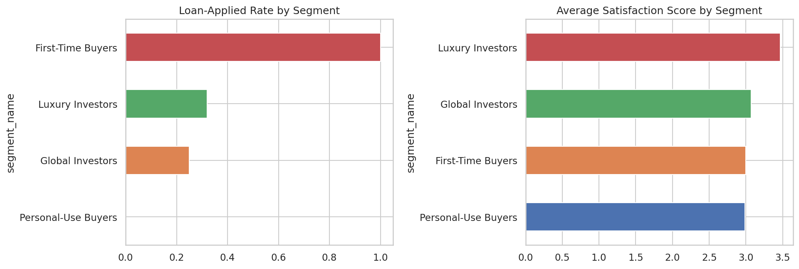
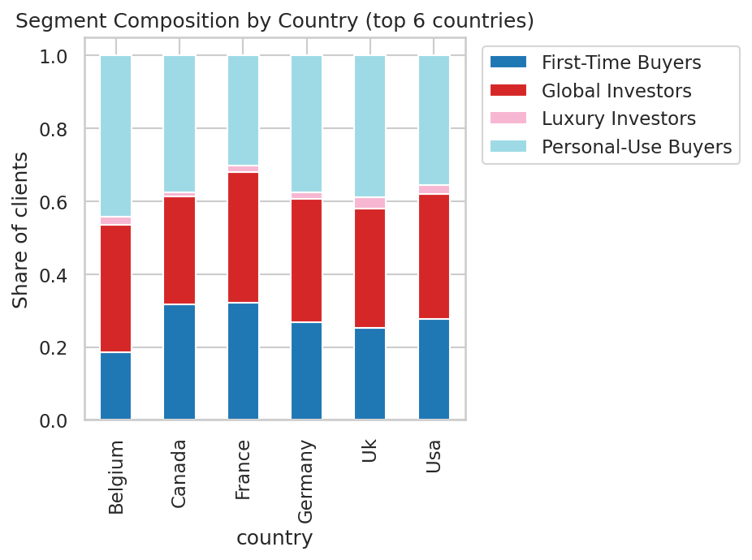

## 6. Business Recommendations

1. **Prioritise white-glove relationship management for Luxury Investors.** Although this
   segment is only 2.4% of the client base, it drives disproportionate revenue
   ($2.47M average spend vs. ~$1.0–1.5M for other segments) and already reports the
   highest satisfaction — a dedicated concierge/relationship-manager motion is likely to
   have an outsized ROI here and support referral-driven growth from this group.

2. **Build a financing-first funnel for First-Time Buyers.** Since 100% of this segment
   used financing, marketing and product content (mortgage-partner offers, financing
   calculators, first-time-buyer guides) should be front-and-centre for any lead that
   matches this profile, rather than generic listing content.

3. **Differentiate Global Investors from Personal-Use Buyers in messaging even though
   both are "mainstream" segments.** Global Investors transact at meaningfully higher
   price points and use financing only a quarter of the time — investment-oriented
   messaging (yield, appreciation potential, portfolio diversification) will resonate
   more than the home-buying narrative that fits Personal-Use Buyers.

4. **Re-evaluate the "Corporate Buyers" go-to-market assumption.** Corporate clients did
   not form their own behavioural cluster in this dataset — they are distributed roughly
   proportionally across all four segments. Parcl should not assume `client_type =
   Company` alone predicts distinct behaviour; if a dedicated corporate-investor
   strategy is a priority, additional corporate-specific data (procurement cycles, deal
   size caps, portfolio mandates) should be captured going forward to make that segment
   separable.

5. **Double down on Website and Agency channels, but track referral quality by
   segment.** Website (55%) and Agency (35%) referrals dominate; because segment
   composition varies little by channel today, Parcl has an opportunity to test
   channel-specific creative aimed at each of the four segments and measure whether
   segment-aware campaigns lift conversion versus today's undifferentiated approach.

6. **Use the interactive dashboard for ongoing monitoring.** Because silhouette scores
   indicate moderate (not razor-sharp) cluster separation, segment membership should be
   refreshed periodically as new transactions arrive, and marketing/sales teams should
   treat segment labels as a strong prior for targeting rather than an immutable
   classification.

## 7. Deliverables

| Deliverable | Location |
|---|---|
| Cleaned & feature-engineered client dataset | `data/clustered_clients.csv` |
| Cluster summary table | `data/cluster_summary.csv` |
| k-selection evaluation table | `data/k_evaluation.csv` |
| Reproducible ML pipeline (cleaning → clustering) | `src/data_processing.py`, `src/clustering.py`, `src/run_analysis.py` |
| Trained model artefacts | `models/*.joblib` |
| All EDA & clustering figures | `reports/figures/` |
| Interactive Streamlit dashboard | `app/streamlit_app.py` |
| This research paper | `reports/research_paper.md` |

## 8. Limitations & Future Work

* Silhouette scores (0.13–0.16) indicate the four segments, while validated across two
  clustering algorithms (ARI = 0.586), are **moderately** rather than sharply separated —
  appropriate for directional targeting, less appropriate for hard eligibility rules.
* `region` was excluded from clustering due to high cardinality relative to dataset size;
  a larger dataset or a grouped/frequency-encoded region feature could allow geography to
  contribute directly to segmentation in future iterations.
* The dataset does not include repeat-visit or engagement data (site visits, email opens,
  time-to-decision), which would likely sharpen segment separation if incorporated.
* Corporate buyers, while not separable in this dataset, may become a distinct segment
  once transaction volume for that group grows or additional B2B-specific fields are
  captured.

---

*Prepared using Python (pandas, scikit-learn, matplotlib, seaborn) and Streamlit. Full
source code and reproduction instructions are in the accompanying GitHub repository's
`README.md`.*
